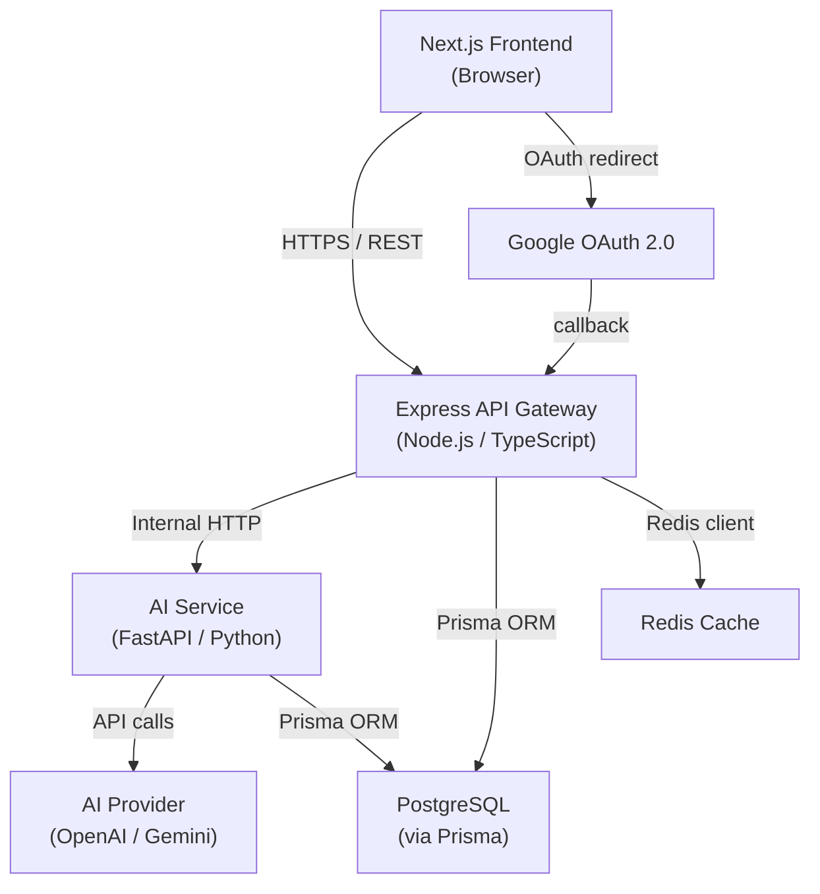
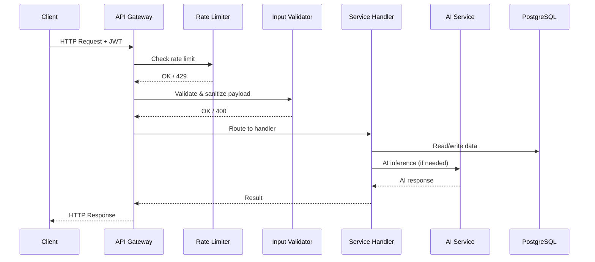

# Design Document: Viraly App

## Overview

Viraly is an AI-powered creator growth coach SaaS that helps Instagram creators produce viral content consistently. The platform combines AI script generation, reel feedback, virality prediction, trend intelligence, and growth analytics into a single daily operating system for content creators.

The system is built as a full-stack TypeScript application with a Next.js frontend, an Express/Node.js API gateway, and a FastAPI service for AI-heavy workloads. PostgreSQL with Prisma handles all data persistence. The architecture separates concerns cleanly: the Next.js app handles UI and BFF (backend-for-frontend) routing, Express handles auth/business logic, and FastAPI handles AI inference calls.

### Key Design Goals

- Stateless JWT-based auth with short-lived access tokens and rotating refresh tokens
- AI workloads isolated in FastAPI to allow independent scaling
- Aggressive caching for expensive AI outputs (scripts cached per day, trends cached 1h)
- Rate limiting enforced at the API gateway layer before any service logic runs
- All sensitive data (API keys) encrypted at rest with AES-256

---

## Architecture



### Service Boundaries

| Layer | Technology | Responsibility |
|---|---|---|
| Frontend | Next.js 14, TypeScript, TailwindCSS | UI rendering, client-side routing, BFF API calls |
| API Gateway | Express, Node.js, TypeScript | Auth, rate limiting, input validation, request routing |
| AI Service | FastAPI, Python | Script generation, reel feedback, virality prediction, trend detection |
| Database | PostgreSQL, Prisma | All persistent data storage and migrations |
| Cache | Redis | Script cache (daily), trend cache (1h), analytics cache (5min) |

### Request Flow



---

## Components and Interfaces

### Auth Service

Handles registration, login, Google OAuth, JWT issuance, and token refresh.

```typescript
interface AuthService {
  register(email: string, password: string): Promise<AuthResult>
  login(email: string, password: string): Promise<AuthResult>
  googleOAuth(code: string): Promise<AuthResult>
  refreshToken(refreshToken: string): Promise<{ accessToken: string }>
  logout(refreshToken: string): Promise<void>
}

interface AuthResult {
  accessToken: string   // JWT, 15min expiry
  refreshToken: string  // opaque token, 7 days expiry
  creator: CreatorProfile
}
```

JWT payload:
```typescript
interface JWTPayload {
  sub: string       // creator ID
  email: string
  iat: number
  exp: number
}
```

### Onboarding Service

```typescript
interface OnboardingService {
  getProfile(creatorId: string): Promise<OnboardingProfile | null>
  saveProfile(creatorId: string, data: OnboardingInput): Promise<OnboardingProfile>
}

interface OnboardingInput {
  displayName: string
  primaryNiche: string
  secondaryNiche?: string
  instagramHandle?: string
  followerCountRange: FollowerRange
  primaryGoal: string
}

type FollowerRange = 'under_1k' | '1k_10k' | '10k_100k' | 'over_100k'
```

### Script Generator

```typescript
interface ScriptGeneratorService {
  getDailyScripts(creatorId: string): Promise<DailyScripts>
}

interface DailyScripts {
  date: string          // YYYY-MM-DD UTC
  scripts: ReelScript[]
  cached: boolean
}

interface ReelScript {
  id: string
  hook: string
  structure: { intro: string; body: string[]; cta: string }
  caption: string
  hashtags: string[]    // 5–30 items
  callToAction: string
}
```

### Streak Service

```typescript
interface StreakService {
  recordDailyAction(creatorId: string): Promise<StreakState>
  getStreak(creatorId: string): Promise<StreakState>
}

interface StreakState {
  current: number
  highest: number
  milestones: MilestoneAchievement[]
  lastActionDate: string  // YYYY-MM-DD UTC
}

interface MilestoneAchievement {
  days: 7 | 30 | 60 | 100
  achievedAt: Date
}
```

### Feedback Service

```typescript
interface FeedbackService {
  submitReel(creatorId: string, url: string): Promise<ReelFeedback>
  getFeedbackHistory(creatorId: string): Promise<ReelFeedback[]>
}

interface ReelFeedback {
  id: string
  url: string
  scores: {
    hookStrength: number      // 0–100
    pacing: number
    captionQuality: number
    hashtagRelevance: number
    ctaEffectiveness: number
  }
  commentary: {
    hookStrength: string
    pacing: string
    captionQuality: string
    hashtagRelevance: string
    ctaEffectiveness: string
  }
  createdAt: Date
}
```

### Virality Engine

```typescript
interface ViralityEngine {
  predict(creatorId: string, reelSubmissionId: string): Promise<ViralityPrediction>
}

interface ViralityPrediction {
  id: string
  score: number           // 0–100
  reachRange: { min: number; max: number }
  suggestions: string[]   // at least 3 when score < 70
  createdAt: Date
}
```

### Trend Radar

```typescript
interface TrendRadarService {
  getTrends(niche?: string): Promise<Trend[]>
  refreshTrends(): Promise<void>  // called by scheduled job
}

interface Trend {
  id: string
  title: string
  description: string
  exampleFormat: string
  engagementLiftPercent: number
  niche: string
  updatedAt: Date
  isStale: boolean  // true if updatedAt > 48h ago
}
```

### Hook Library

```typescript
interface HookLibraryService {
  searchHooks(params: HookSearchParams): Promise<PaginatedResult<Hook>>
  saveHook(creatorId: string, hookId: string): Promise<void>
  getSavedHooks(creatorId: string): Promise<Hook[]>
}

interface HookSearchParams {
  niche?: string
  query?: string
  page?: number       // default 1
  pageSize?: number   // default 20, max 100
}

interface Hook {
  id: string
  content: string
  niches: string[]
  relevanceScore: number
}
```

### Analytics Dashboard

```typescript
interface AnalyticsDashboardService {
  getDashboard(creatorId: string): Promise<DashboardData>
  exportCSV(creatorId: string): Promise<string>  // CSV string
}

interface DashboardData {
  followerCount: number
  followerGrowth7d: number
  followerGrowth30d: number
  postingConsistency30d: number   // percentage
  streak: StreakState
  reels: ReelSummary[]
  cachedAt: Date
}
```

### Monetization Coach

```typescript
interface MonetizationCoachService {
  getModules(creatorId: string): Promise<ModuleWithProgress[]>
  completeLesson(creatorId: string, lessonId: string): Promise<void>
  getOverallProgress(creatorId: string): Promise<number>  // percentage
}

interface ModuleWithProgress {
  id: string
  title: string
  lessons: LessonWithCompletion[]
  completionPercent: number
}
```

### API Gateway Middleware Stack

```
Request → HTTPS enforcement → CORS check → JWT verification → Rate limiter → Input validator → Route handler
```

---

## Data Models

All models are managed via Prisma. Below is the complete schema design.

```prisma
model Creator {
  id                String    @id @default(cuid())
  email             String    @unique
  passwordHash      String?   // null for OAuth-only accounts
  googleId          String?   @unique
  displayName       String?
  primaryNiche      String?
  secondaryNiche    String?
  instagramHandle   String?
  followerCountRange String?
  primaryGoal       String?
  onboardingComplete Boolean  @default(false)
  encryptedApiKey   String?   // AES-256 encrypted
  createdAt         DateTime  @default(now())
  updatedAt         DateTime  @updatedAt

  sessions          Session[]
  scripts           Script[]
  streak            Streak?
  reelSubmissions   ReelSubmission[]
  savedHooks        SavedHook[]
  analyticsSnapshots AnalyticsSnapshot[]
  lessonCompletions LessonCompletion[]
}

model Session {
  id           String   @id @default(cuid())
  creatorId    String
  refreshToken String   @unique
  expiresAt    DateTime
  createdAt    DateTime @default(now())

  creator      Creator  @relation(fields: [creatorId], references: [id], onDelete: Cascade)
}

model Script {
  id        String   @id @default(cuid())
  creatorId String
  date      String   // YYYY-MM-DD UTC
  scripts   Json     // serialized ReelScript[]
  createdAt DateTime @default(now())

  creator   Creator  @relation(fields: [creatorId], references: [id], onDelete: Cascade)

  @@unique([creatorId, date])
}

model Streak {
  id             String   @id @default(cuid())
  creatorId      String   @unique
  current        Int      @default(0)
  highest        Int      @default(0)
  lastActionDate String?  // YYYY-MM-DD UTC
  milestones     Json     @default("[]")
  updatedAt      DateTime @updatedAt

  creator        Creator  @relation(fields: [creatorId], references: [id], onDelete: Cascade)
}

model ReelSubmission {
  id          String   @id @default(cuid())
  creatorId   String
  url         String
  feedback    Json?    // ReelFeedback scores + commentary
  submittedAt DateTime @default(now())

  creator     Creator  @relation(fields: [creatorId], references: [id], onDelete: Cascade)
  prediction  ViralityPrediction?
}

model ViralityPrediction {
  id               String         @id @default(cuid())
  creatorId        String
  reelSubmissionId String         @unique
  score            Int
  reachMin         Int
  reachMax         Int
  suggestions      Json           // string[]
  createdAt        DateTime       @default(now())

  creator          Creator        @relation(fields: [creatorId], references: [id], onDelete: Cascade)
  reelSubmission   ReelSubmission @relation(fields: [reelSubmissionId], references: [id], onDelete: Cascade)
}

model Trend {
  id                    String   @id @default(cuid())
  title                 String
  description           String
  exampleFormat         String
  engagementLiftPercent Float
  niche                 String
  updatedAt             DateTime @updatedAt
  createdAt             DateTime @default(now())
}

model Hook {
  id             String      @id @default(cuid())
  content        String
  niches         String[]
  relevanceScore Float       @default(0)
  createdAt      DateTime    @default(now())

  savedBy        SavedHook[]
}

model SavedHook {
  id        String   @id @default(cuid())
  creatorId String
  hookId    String
  savedAt   DateTime @default(now())

  creator   Creator  @relation(fields: [creatorId], references: [id], onDelete: Cascade)
  hook      Hook     @relation(fields: [hookId], references: [id], onDelete: Cascade)

  @@unique([creatorId, hookId])
}

model AnalyticsSnapshot {
  id                   String   @id @default(cuid())
  creatorId            String
  followerCount        Int
  followerGrowth7d     Int
  followerGrowth30d    Int
  postingConsistency30d Float
  snapshotAt           DateTime @default(now())

  creator              Creator  @relation(fields: [creatorId], references: [id], onDelete: Cascade)
}

model MonetizationModule {
  id       String               @id @default(cuid())
  title    String
  order    Int
  lessons  MonetizationLesson[]
}

model MonetizationLesson {
  id               String             @id @default(cuid())
  moduleId         String
  title            String
  body             String
  estimatedReadMin Int
  order            Int
  audienceLevel    String             // 'beginner' | 'intermediate' | 'advanced'

  module           MonetizationModule @relation(fields: [moduleId], references: [id], onDelete: Cascade)
  completions      LessonCompletion[]
}

model LessonCompletion {
  id          String             @id @default(cuid())
  creatorId   String
  lessonId    String
  completedAt DateTime           @default(now())

  creator     Creator            @relation(fields: [creatorId], references: [id], onDelete: Cascade)
  lesson      MonetizationLesson @relation(fields: [lessonId], references: [id], onDelete: Cascade)

  @@unique([creatorId, lessonId])
}
```

### Caching Strategy

| Data | Cache Key | TTL |
|---|---|---|
| Daily scripts | `scripts:{creatorId}:{date}` | Until midnight UTC |
| Trend data | `trends:{niche\|all}` | 1 hour |
| Analytics dashboard | `analytics:{creatorId}` | 5 minutes |
| Rate limit counters | `ratelimit:{creatorId}` | 1 minute sliding window |


---

## Correctness Properties

*A property is a characteristic or behavior that should hold true across all valid executions of a system — essentially, a formal statement about what the system should do. Properties serve as the bridge between human-readable specifications and machine-verifiable correctness guarantees.*

### Property 1: Registration validates email uniqueness and password length

*For any* pair of registration attempts where either the email already exists in the system or the password is fewer than 8 characters, the Auth_Service SHALL reject the request and no new Creator record SHALL be created.

**Validates: Requirements 1.3**

---

### Property 2: Issued tokens have correct expiry

*For any* successful authentication, the returned JWT access token SHALL have an expiry of exactly 15 minutes from issuance and the refresh token SHALL have an expiry of exactly 7 days from issuance.

**Validates: Requirements 1.4**

---

### Property 3: Refresh token round-trip

*For any* valid Creator session, presenting the refresh token to the token refresh endpoint SHALL return a new valid access token, and the old access token SHALL no longer be accepted after expiry.

**Validates: Requirements 1.5**

---

### Property 4: Invalid credential error indistinguishability

*For any* login attempt with an unrecognized email and *for any* login attempt with a recognized email but wrong password, the error response body SHALL be identical — neither response SHALL indicate which field was incorrect.

**Validates: Requirements 1.6**

---

### Property 5: Logout invalidates refresh token

*For any* Creator session, after the Creator logs out, presenting the previously valid refresh token SHALL return an error and SHALL NOT issue a new access token.

**Validates: Requirements 1.7**

---

### Property 6: Passwords stored as bcrypt hashes with cost >= 12

*For any* Creator registered with a password, the stored credential SHALL be a valid bcrypt hash with a cost factor of at least 12, and the plaintext password SHALL NOT appear anywhere in the database.

**Validates: Requirements 1.8**

---

### Property 7: API keys stored encrypted

*For any* Creator with a stored API key, the value persisted in the database SHALL NOT equal the plaintext key — it SHALL be an AES-256 encrypted ciphertext.

**Validates: Requirements 1.9**

---

### Property 8: Authenticated request context always contains Creator identity

*For any* request that passes JWT verification, the request context SHALL contain the Creator's ID matching the `sub` claim of the JWT.

**Validates: Requirements 1.10**

---

### Property 9: Onboarding required fields validation

*For any* onboarding form submission where one or more required fields (displayName, primaryNiche, followerCountRange, primaryGoal) are absent or empty, the Onboarding_Service SHALL reject the submission and SHALL NOT persist any data.

**Validates: Requirements 2.3**

---

### Property 10: Onboarding profile association round-trip

*For any* Creator who completes onboarding, retrieving the profile by that Creator's ID SHALL return the exact data that was submitted.

**Validates: Requirements 2.4**

---

### Property 11: Onboarding pre-population round-trip

*For any* Creator with a saved onboarding profile, fetching the onboarding form data SHALL return values that match the previously persisted profile fields.

**Validates: Requirements 2.6**

---

### Property 12: Daily script count and structure invariant

*For any* Creator with a set primary niche, a request to the Script_Generator SHALL return exactly 3 scripts, and each script SHALL contain a non-empty hook, a structure object with intro/body/cta, a caption, a hashtag array with between 5 and 30 entries, and a call-to-action string.

**Validates: Requirements 3.1, 3.2**

---

### Property 13: Script generation idempotence within a calendar day

*For any* Creator, calling getDailyScripts twice on the same UTC calendar day SHALL return the same 3 scripts (same IDs and content), with the second response marked as cached.

**Validates: Requirements 3.4**

---

### Property 14: Streak increment on first daily action

*For any* Creator whose last action date is not today (UTC), recording a daily action SHALL increment the streak count by exactly 1 and update the last action date to today.

**Validates: Requirements 4.1, 4.2**

---

### Property 15: Streak highest count never decreases

*For any* sequence of streak operations on a Creator (including resets), the highest streak value SHALL never be less than any previously recorded highest value.

**Validates: Requirements 4.6**

---

### Property 16: Milestone recorded at threshold crossings

*For any* Creator whose streak count transitions to exactly 7, 30, 60, or 100, the Streak_Service SHALL record a milestone achievement for that threshold value with the current timestamp.

**Validates: Requirements 4.4**

---

### Property 17: Reel URL domain validation

*For any* URL submitted to the Feedback_Service, the service SHALL accept the URL if and only if its hostname is `instagram.com` or `tiktok.com` (including subdomains). All other domains SHALL be rejected with an error response.

**Validates: Requirements 5.1, 5.5**

---

### Property 18: Reel feedback structure completeness

*For any* accepted reel submission that completes AI analysis, the returned feedback SHALL contain numeric scores and string commentary for all five dimensions: hookStrength, pacing, captionQuality, hashtagRelevance, and ctaEffectiveness.

**Validates: Requirements 5.2**

---

### Property 19: Reel feedback persistence round-trip

*For any* Creator who submits a reel, the submission SHALL appear in that Creator's feedback history with the correct URL and feedback data.

**Validates: Requirements 5.4**

---

### Property 20: Reel submission daily limit enforcement

*For any* Creator who has already submitted 10 reels within the current 24-hour window, the 11th submission attempt SHALL be rejected with an appropriate error response.

**Validates: Requirements 5.6**

---

### Property 21: Virality prediction output invariants

*For any* virality prediction result, the score SHALL be an integer in [0, 100], reachMin SHALL be less than or equal to reachMax, and when the score is below 70 the suggestions array SHALL contain at least 3 entries.

**Validates: Requirements 6.1, 6.2, 6.3**

---

### Property 22: Virality prediction persistence round-trip

*For any* Creator and reel submission, after requesting a prediction, retrieving predictions for that Creator SHALL include a prediction linked to the correct reel submission ID.

**Validates: Requirements 6.5**

---

### Property 23: Trend default view excludes stale data

*For any* call to getTrends without explicit stale inclusion, all returned trends SHALL have an updatedAt timestamp within the last 48 hours.

**Validates: Requirements 7.1, 7.4**

---

### Property 24: Trend structure completeness

*For any* trend returned by the Trend_Radar, the object SHALL contain non-empty title, description, exampleFormat, and a numeric engagementLiftPercent.

**Validates: Requirements 7.2**

---

### Property 25: Trend niche filter correctness

*For any* niche filter value passed to getTrends, every returned trend SHALL have a niche field equal to the requested niche.

**Validates: Requirements 7.3**

---

### Property 26: Hook niche filter correctness

*For any* niche value passed to the Hook_Library query, every returned hook SHALL include that niche in its niches array.

**Validates: Requirements 8.1, 8.2**

---

### Property 27: Hook unfiltered results ordered by relevance

*For any* unfiltered Hook_Library query, the returned hooks SHALL be ordered in non-increasing order of relevanceScore.

**Validates: Requirements 8.3**

---

### Property 28: Hook pagination size invariant

*For any* Hook_Library query, the number of returned results SHALL be less than or equal to the requested pageSize, the pageSize SHALL be capped at 100, and the default pageSize SHALL be 20.

**Validates: Requirements 8.5**

---

### Property 29: Saved hook round-trip

*For any* Creator who saves a hook, retrieving that Creator's saved hooks SHALL include the saved hook.

**Validates: Requirements 8.6**

---

### Property 30: Posting consistency computation correctness

*For any* Creator, the postingConsistency30d value in the dashboard SHALL equal the number of distinct days in the last 30 days on which the Creator completed a daily action, divided by 30, expressed as a percentage.

**Validates: Requirements 9.2**

---

### Property 31: Analytics CSV export round-trip

*For any* Creator with dashboard data, exporting to CSV SHALL produce a file where each row corresponds to a data point present in the dashboard, and no dashboard data SHALL be omitted from the export.

**Validates: Requirements 9.7**

---

### Property 32: Lesson structure completeness

*For any* MonetizationLesson in the system, the lesson SHALL have a non-empty title, non-empty body, and a positive estimatedReadMin value.

**Validates: Requirements 10.2**

---

### Property 33: Lesson completion progress update

*For any* Creator who completes a lesson, the module's completionPercent SHALL increase (or remain at 100% if already complete), and the lesson SHALL appear in the Creator's completion records.

**Validates: Requirements 10.3**

---

### Property 34: Overall completion percentage computation

*For any* Creator, the overall completion percentage SHALL equal (total completed lessons / total lessons across all modules) × 100, rounded to the nearest integer.

**Validates: Requirements 10.4**

---

### Property 35: Beginner lessons surfaced first for small creators

*For any* Creator with a followerCountRange of 'under_1k', the lessons returned by getModules SHALL list all lessons with audienceLevel 'beginner' before any lessons with audienceLevel 'intermediate' or 'advanced'.

**Validates: Requirements 10.5**

---

### Property 36: Rate limit enforcement

*For any* Creator who sends more than 100 requests within a 60-second sliding window, every request beyond the 100th SHALL receive an HTTP 429 response containing a Retry-After header.

**Validates: Requirements 11.1, 11.2**

---

### Property 37: Injection pattern rejection

*For any* request payload containing SQL injection patterns (e.g., `'; DROP TABLE`, `OR 1=1`) or script injection patterns (e.g., `<script>`, `javascript:`), the Input_Validator SHALL return an HTTP 400 response and SHALL NOT pass the payload to any service handler.

**Validates: Requirements 11.4**

---

### Property 38: JWT required on protected endpoints

*For any* request to a non-public endpoint (i.e., not registration, login, or OAuth callback) that lacks a valid JWT access token, the API_Gateway SHALL return an HTTP 401 response.

**Validates: Requirements 11.5**

---

### Property 39: Cascade delete removes all associated records

*For any* Creator with associated Sessions, Scripts, Streaks, ReelSubmissions, ViralityPredictions, SavedHooks, AnalyticsSnapshots, and LessonCompletions, deleting the Creator SHALL result in all associated records being removed from the database.

**Validates: Requirements 12.4**

---

### Property 40: Creator email uniqueness at database level

*For any* two Creator records, their email fields SHALL be distinct — any attempt to insert a Creator with an email that already exists SHALL fail with a unique constraint violation.

**Validates: Requirements 12.5**

---

### Property 41: All timestamps stored in UTC

*For any* record in any model that contains a timestamp field (createdAt, updatedAt, completedAt, snapshotAt, etc.), the stored value SHALL be in UTC with no timezone offset applied.

**Validates: Requirements 12.6**

---

## Error Handling

### Auth Errors

| Scenario | HTTP Status | Response |
|---|---|---|
| Invalid credentials | 401 | Generic "Invalid credentials" (no field hint) |
| Expired access token | 401 | `{ error: "token_expired" }` |
| Invalid/expired refresh token | 401 | `{ error: "invalid_refresh_token" }` |
| Email already registered | 409 | `{ error: "email_taken" }` |
| Password too short | 400 | `{ error: "password_too_short", minLength: 8 }` |

### AI Service Errors

All AI-dependent services (Script_Generator, Feedback_Service, Virality_Engine) follow the same retry pattern:

```
1. Call AI provider
2. On error: wait 1s, retry once
3. On second failure: return { error: "ai_service_unavailable", message: "<descriptive>" }
```

### Validation Errors

All validation failures return HTTP 400 with a structured body:
```json
{
  "error": "validation_failed",
  "fields": [{ "field": "email", "message": "must be a valid email address" }]
}
```

### Rate Limit Errors

```json
HTTP 429
Retry-After: 42
{ "error": "rate_limit_exceeded", "retryAfterSeconds": 42 }
```

### Domain Validation (Reel Submission)

```json
HTTP 400
{ "error": "unsupported_domain", "message": "Only Instagram and TikTok URLs are accepted" }
```

### Onboarding Incomplete

```json
HTTP 422
{ "error": "onboarding_incomplete", "message": "Complete your profile to use this feature" }
```

---

## Testing Strategy

### Dual Testing Approach

Both unit tests and property-based tests are required. They are complementary:

- Unit tests catch concrete bugs with specific known inputs and edge cases
- Property-based tests verify universal correctness across the full input space

### Property-Based Testing

**Library**: [fast-check](https://github.com/dubzzz/fast-check) (TypeScript/Node.js) for the Express API layer; [Hypothesis](https://hypothesis.readthedocs.io/) (Python) for the FastAPI AI service layer.

**Configuration**: Each property test MUST run a minimum of 100 iterations.

**Tag format**: Each property test MUST include a comment in the format:
```
// Feature: viraly-app, Property N: <property_text>
```

**One test per property**: Each correctness property defined above MUST be implemented by exactly one property-based test.

**Example (fast-check)**:
```typescript
// Feature: viraly-app, Property 12: Daily script count and structure invariant
it('generates exactly 3 scripts with valid structure for any creator with a niche', async () => {
  await fc.assert(
    fc.asyncProperty(fc.record({ niche: fc.constantFrom('fitness', 'finance', 'comedy') }), async ({ niche }) => {
      const result = await scriptGenerator.getDailyScripts(mockCreatorWithNiche(niche))
      expect(result.scripts).toHaveLength(3)
      result.scripts.forEach(s => {
        expect(s.hook).toBeTruthy()
        expect(s.hashtags.length).toBeGreaterThanOrEqual(5)
        expect(s.hashtags.length).toBeLessThanOrEqual(30)
        expect(s.callToAction).toBeTruthy()
      })
    }),
    { numRuns: 100 }
  )
})
```

### Unit Testing

Unit tests focus on:
- Specific examples that demonstrate correct behavior (e.g., a known valid registration flow)
- Integration points between components (e.g., streak service calling analytics)
- Edge cases and error conditions (e.g., AI provider failure triggers retry)
- Examples identified in prework (2.1, 2.5, 3.5, 3.7, 4.3, 4.5, 6.6, 9.1, 9.3, 9.4, 9.5, 11.7, 12.3)

Avoid writing unit tests that duplicate what property tests already cover. Unit tests should be reserved for scenarios where the input space is small and well-defined.

### Test Organization

```
tests/
  unit/
    auth/
    onboarding/
    scripts/
    streak/
    feedback/
    virality/
    trends/
    hooks/
    analytics/
    monetization/
    security/
  property/
    auth.property.test.ts
    onboarding.property.test.ts
    scripts.property.test.ts
    streak.property.test.ts
    feedback.property.test.ts
    virality.property.test.ts
    trends.property.test.ts
    hooks.property.test.ts
    analytics.property.test.ts
    monetization.property.test.ts
    security.property.test.ts
    schema.property.test.ts
```

### Coverage Targets

- All 41 correctness properties must have a corresponding property-based test
- All example-type acceptance criteria must have a corresponding unit test
- Critical paths (auth, payment, data deletion) should have integration tests
